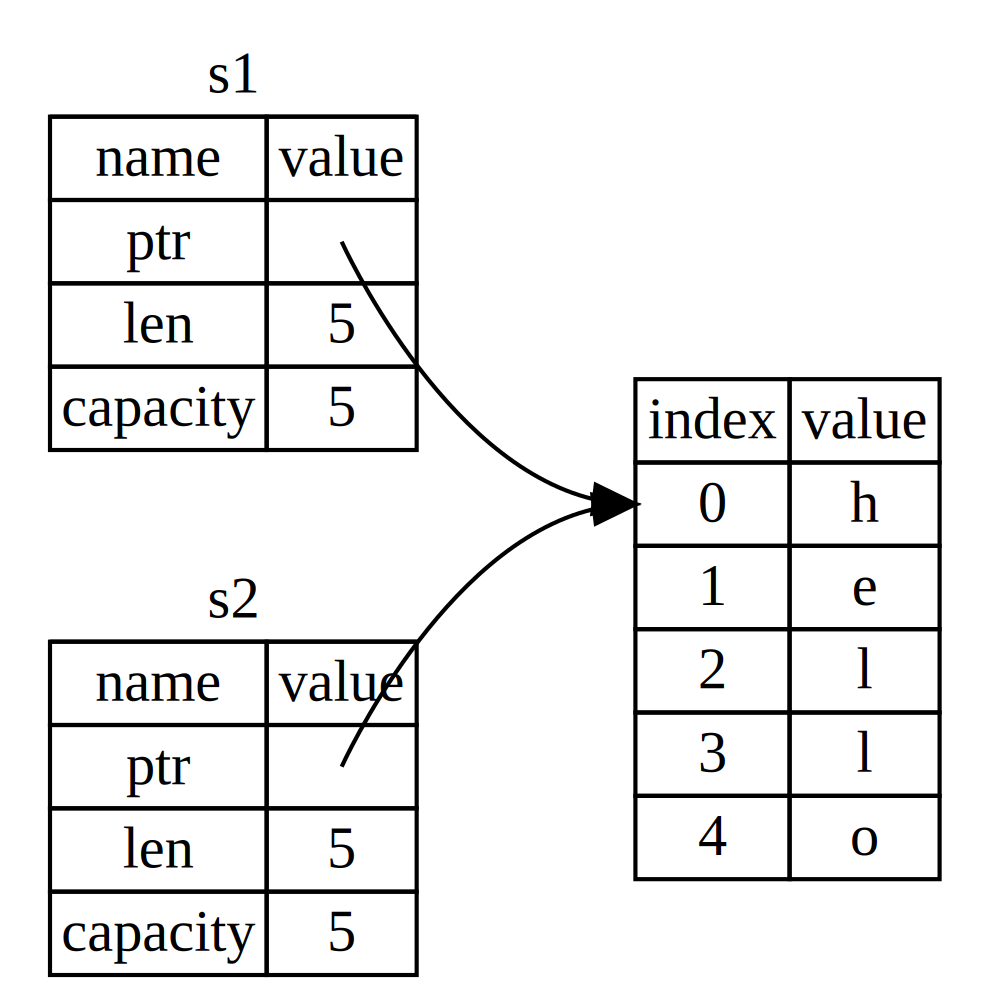
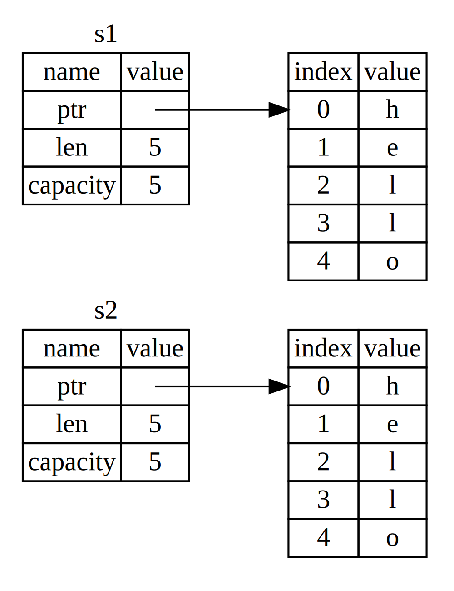
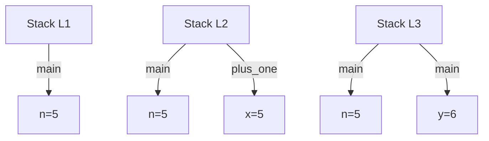
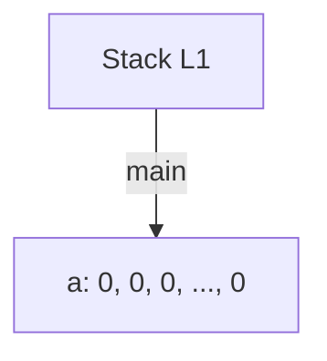
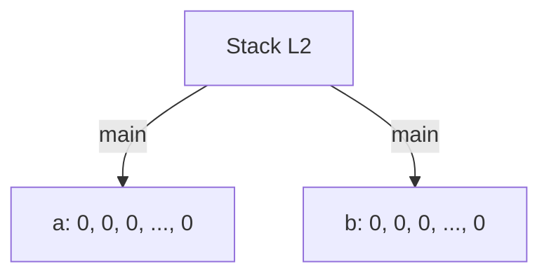
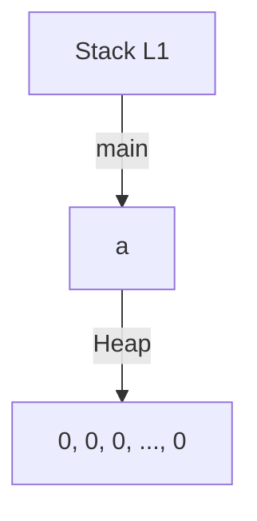
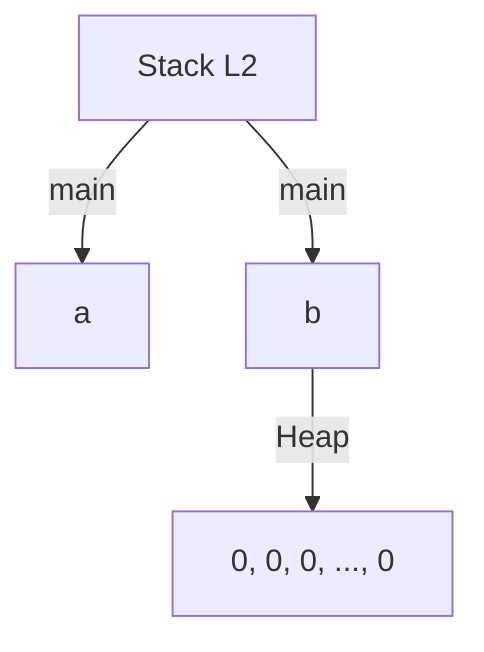

# What is Ownership?

- [Definition One](#definition-1)
- [Definition Two](#definition-2)

## Definition 1:

Ownership is a set of rules that governs how Rust programs manage memory. Memory management is crucial for all programs. Some languages use garbage collection to automatically find and free unused memory, while others require the programmer to explicitly manage memory. Rust, however, uses a unique system of ownership. This system allows Rust to make memory safety guarantees without needing a garbage collector, and it checks these rules at compile time. If any of the ownership rules are violated, the program won’t compile.

Rust’s approach to memory management comes with zero runtime overhead. Although ownership is a new concept for many programmers, as you become more experienced with Rust, you'll naturally develop a sense of how to write memory-safe, efficient code.

Ownership is key to understanding Rust’s features, and in this chapter, we’ll use common examples to explain ownership by focusing on a familiar data structure: strings.

> ### The Stack and the Heap
>
> In many programming languages, the distinction between the stack and the heap isn’t something you need to think about often. However, in Rust, understanding whether a value is stored on the stack or the heap is important, as it affects how the language behaves and why certain decisions must be made.
>
> The stack and the heap are different parts of memory available at runtime:
>
> - **The Stack:** Stores values in the order they are received and removes them in reverse order (last in, first out). Only values with a fixed size at compile time are stored on the stack.
>
> - **The Heap:** Stores data with an unknown or variable size. When you put data on the heap, you allocate memory, and a pointer to the heap location is stored on the stack.

### Ownership Rules

There are three key rules of ownership:

- Each value in Rust has a single owner.
- There can only be one owner of a value at a time.
- When the owner goes out of scope, the value is dropped.

### Variable Scope

Now that we’re past basic Rust syntax, we won’t include all the` fn main() {` code in examples, so if you’re following along, make sure to put the following examples inside a main function manually. As a result, our examples will be a bit more concise, letting us focus on the actual details rather than boilerplate code.

A scope in Rust defines where a variable is valid. For example:

```rust
{
    let s = "hello"; // s is valid from this point onward
    // use s
} // s is now out of scope and no longer valid
```

The variable `s` is valid within its scope and is dropped when the scope ends.

In other words, there are two important points in time here:

- When `s` comes into scope, it is valid.
- It remains valid until it goes out of scope.

At this point, the relationship between scopes and when variables are valid is similar to that in other programming languages. Now we’ll build on top of this understanding by introducing the `String` type.

### The `String` Type

To illustrate the rules of ownership, we need a data type that is more complex than those we covered in the “[Data Types](https://github.com/nimodb/rust-journey/tree/main/3-common-programming-concepts/4-data-types)” section of Chapter 3. The types covered previously are of a known size, can be stored on the stack and popped off the stack when their scope is over, and can be quickly and trivially copied to make a new, independent instance if another part of code needs to use the same value in a different scope. But we want to look at data that is stored on the heap and explore how Rust knows when to clean up that data, and the `String` type is a great example.

We’ll concentrate on the parts of `String` that relate to ownership. These aspects also apply to other complex data types, whether they are provided by the standard library or created by you. We’ll discuss `String` in more depth in [Chapter 8]().

We’ve already seen string literals, where a string value is hardcoded into our program. String literals are convenient, but they aren’t suitable for every situation in which we may want to use text. One reason is that they’re immutable. Another is that not every string value can be known when we write our code: for example, what if we want to take user input and store it? For these situations, Rust has a second string type, `String`. This type manages data allocated on the heap and as such is able to store an amount of text that is unknown to us at compile time. You can create a `String` from a string literal using the `from` function, like so:

```rust
let s = String::from("hello");
```

The double colon `::` operator allows us to namespace this particular from function under the String type rather than using some sort of name like `string_from`. We’ll discuss this syntax more in the “[Method Syntax]()” section of Chapter 5, and when we talk about namespacing with modules in “[Paths for Referring to an Item in the Module Tree]()” in Chapter 7.

This kind of string can be mutated:

```rust
let mut s = String::from("hello");

s.push_str(", world!"); // push_str() appends a literal to a String

println!("{s}"); // This will print `hello, world!`
```

So, what’s the difference here? Why can String be mutated but literals cannot? The difference between string literals and `String` comes from how they manage memory. String literals are stored on the stack, while `String` values are stored on the heap, allowing them to be mutable and dynamic.

### Memory and Allocation

When using a string literal in Rust, the content is known at compile time, so it gets hardcoded into the final executable, making string literals efficient and immutable. However, for a mutable string like `String`, Rust allocates memory on the heap at runtime because the size is unknown beforehand and can change while the program runs.

- Memory must be requested from the allocator at runtime, and we need to return this memory once we’re done with the `String`.

- In contrast to languages with a garbage collector (GC), where memory management is automatic, Rust uses a different mechanism called ownership. When a variable goes out of scope, Rust automatically frees the memory by calling the [`drop`](https://doc.rust-lang.org/std/ops/trait.Drop.html#tymethod.drop) function. This feature prevents common memory management issues like **double frees** or **memory leaks**.

Rust takes a different path: the memory is automatically returned once the variable that owns it goes out of scope. Here’s a version of our scope example using a `String` instead of a string literal:

```rust
    {
        let s = String::from("hello"); // s is valid from this point forward

        // do stuff with s
    }
    // this scope is now over, and s is no longer valid
```

When the variable `s` goes out of scope, Rust calls `drop` and frees the associated memory.

> **Note:** In C++, this pattern of deallocating resources at the end of an item’s lifetime is sometimes called _Resource Acquisition Is Initialization (RAII)_. The drop function in Rust will be familiar to you if you’ve used RAII patterns.

#### Variables and Data Interacting with Move

Multiple variables can interact with the same data in different ways in Rust. Let’s look at an example using an integer:

```rust
let x = 5;
let y = x;
```

We can probably guess what this is doing: “bind the value `5` to `x`; then make a copy of the value in `x` and bind it to `y`.” We now have two variables, `x` and `y`, and both equal `5`. This is indeed what is happening, because integers are simple values with a known, fixed size, and these two `5` values are pushed onto the stack.

Now let’s look at the `String` version:

```rust
let s1 = String::from("hello");
let s2 = s1;
```

This looks very similar, so we might assume that the way it works would be the same: that is, the second line would make a copy of the value in `s1` and bind it to `s2`. But this isn’t quite what happens.

Take a look to see what is happening to `String` under the covers. A `String` is made up of three parts, shown on the left: a pointer to the memory that holds the contents of the string, a length, and a capacity. This group of data is stored on the stack. On the right is the memory on the heap that holds the contents.


The length is how much memory, in bytes, the contents of the `String` are currently using. The capacity is the total amount of memory, in bytes, that the `String` has received from the allocator. The difference between length and capacity matters, but not in this context, so for now, it’s fine to ignore the capacity.

When we assign `s1` to `s2`, the `String` data is copied, meaning we copy the pointer, the length, and the capacity that are on the stack. We do not copy the data on the heap that the pointer refers to.



The representation does _not_ look like image below, which is what memory would look like if Rust instead copied the heap data as well. If Rust did this, the operation `s2 = s1` could be very expensive in terms of runtime performance if the data on the heap were large.



This move mechanism prevents multiple variables from pointing to the same heap memory, which could lead to **double-free** errors if both variables went out of scope and tried to free the same memory.

To ensure memory safety, after the line let `s2 = s1;`, Rust considers `s1` as no longer valid. Therefore, Rust doesn’t need to free anything when `s1` goes out of scope. Check out what happens when you try to use `s1` after `s2` is created; it won’t work:

```rust
let s1 = String::from("hello");
let s2 = s1;

println!("{s1}, world!");
```

You’ll get an error like this because Rust prevents you from using the invalidated reference:

```bash
$ cargo run
   Compiling ownership v0.1.0 (file:///projects/ownership)
error[E0382]: borrow of moved value: `s1`
 --> src/main.rs:5:15
  |
2 |     let s1 = String::from("hello");
  |         -- move occurs because `s1` has type `String`, which does not implement the `Copy` trait
3 |     let s2 = s1;
  |              -- value moved here
4 |
5 |     println!("{s1}, world!");
  |               ^^^^ value borrowed here after move
  |
  = note: this error originates in the macro `$crate::format_args_nl` which comes from the expansion of the macro `println` (in Nightly builds, run with -Z macro-backtrace for more info)
help: consider cloning the value if the performance cost is acceptable
  |
3 |     let s2 = s1.clone();
  |                ++++++++

For more information about this error, try `rustc --explain E0382`.
error: could not compile `ownership` (bin "ownership") due to 1 previous error
```

If you’ve heard the terms shallow copy and deep copy while working with other languages, the concept of copying the pointer, length, and capacity without copying the data probably sounds like making a shallow copy. But because Rust also invalidates the first variable, instead of being called a shallow copy, it’s known as a move. In this example, we would say that `s1` was moved into `s2`.


That solves our problem! With only `s2` valid, when it goes out of scope it alone will free the memory, and we’re done.

In addition, there’s a design choice that’s implied by this: Rust will never automatically create “deep” copies of your data. Therefore, any _automatic_ copying can be assumed to be inexpensive in terms of runtime performance.

#### Variables and Data Interacting with Clone

If we do want to deeply copy the heap data of the `String`, not just the stack data, we can use a common method called `clone`. We’ll discuss method syntax in [Chapter 5](), but because methods are a common feature in many programming languages, you’ve probably seen them before.

Here’s an example of the `clone` method in action:

```rust
let s1 = String::from("hello");
let s2 = s1.clone();

println!("s1 = {s1}, s2 = {s2}");
```

When you see a call to `clone`, you know that some arbitrary code is being executed and that code may be expensive. It’s a visual indicator that something different is going on.

#### Stack-Only Data: Copy

For simple types like integers, Rust uses the Copy trait, which allows for values to be trivially copied:

```rust
let x = 5;
let y = x;

println!("x = {x}, y = {y}");
```

But this code seems to contradict what we just learned: we don’t have a call to `clone`, but `x` is still valid and wasn’t moved into `y`.

The reason is that types such as integers that have a known size at compile time are stored entirely on the stack, so copies of the actual values are quick to make. That means there’s no reason we would want to prevent `x` from being valid after we create the variable `y`. In other words, there’s no difference between deep and shallow copying here, so calling `clone` wouldn’t do anything different from the usual shallow copying, and we can leave it out.

Rust has a special annotation called the `Copy` trait that we can place on types that are stored on the stack, as integers are (we’ll talk more about traits in [Chapter 10]()). If a type implements the `Copy` trait, variables that use it do not move, but rather are trivially copied, making them still valid after assignment to another variable.

Rust won’t let us annotate a type with `Copy` if the type, or any of its parts, has implemented the `Drop` trait. If the type needs something special to happen when the value goes out of scope and we add the `Copy` annotation to that type, we’ll get a compile-time error. To learn about how to add the `Copy` annotation to your type to implement the trait, see “[Derivable Traits]()” in Appendix C.

So, what types implement the `Copy` trait? You can check the documentation for the given type to be sure, but as a general rule, any group of simple scalar values can implement `Copy`, and nothing that requires allocation or is some form of resource can implement `Copy`. Here are some of the types that implement `Copy`:

- All the integer types, such as `u32`.
- The Boolean type, `bool`, with values `true` and `false`.
- All the floating-point types, such as `f64`.
- The character type, `char`.
- Tuples, if they only contain types that also implement `Copy`. For example, `(i32, i32)` implements `Copy`, but `(i32, String)` does not.

### Ownership and Functions

In Rust, functions work with ownership and scope similarly to how assignment does. When passing a variable to a function, it can be moved or copied just like in assignment. Here’s an example demonstrating this:

```rust
fn main() {
    let s = String::from("hello");  // s comes into scope

    takes_ownership(s);             // s's value moves into the function...
                                    // ... and so is no longer valid here

    let x = 5;                      // x comes into scope

    makes_copy(x);                  // x would move into the function,
                                    // but i32 is Copy, so it's okay to still
                                    // use x afterward

} // Here, x goes out of scope, then s. But because s's value was moved, nothing
  // special happens.

fn takes_ownership(some_string: String) { // some_string comes into scope
    println!("{some_string}");
} // Here, some_string goes out of scope and `drop` is called. The backing
  // memory is freed.

fn makes_copy(some_integer: i32) { // some_integer comes into scope
    println!("{some_integer}");
} // Here, some_integer goes out of scope. Nothing special happens.
```

In this example, `takes_ownership` takes ownership of the `String` parameter `some_string`, which means that after calling this function, the `String` variable `s` is no longer valid in the `main` function. Conversely, `makes_copy` takes an integer, which is a `Copy` type, so `x` is still valid after the function call.

If you tried to use `s` after calling `takes_ownership`, Rust would produce a compile-time error. This behavior ensures that ownership rules are enforced to prevent errors related to invalid memory access.

### Return Values and Scope

Functions can also transfer ownership through return values. Here’s how it works:

```rust
fn main() {
    let s1 = gives_ownership();         // gives_ownership moves its return
                                        // value into s1

    let s2 = String::from("hello");     // s2 comes into scope

    let s3 = takes_and_gives_back(s2);  // s2 is moved into
                                        // takes_and_gives_back, which also
                                        // moves its return value into s3
} // Here, s3 goes out of scope and is dropped. s2 was moved, so nothing
  // happens. s1 goes out of scope and is dropped.

fn gives_ownership() -> String {             // gives_ownership will move its
                                             // return value into the function
                                             // that calls it

    let some_string = String::from("yours"); // some_string comes into scope

    some_string                              // some_string is returned and
                                             // moves out to the calling
                                             // function
}

// This function takes a String and returns one
fn takes_and_gives_back(a_string: String) -> String { // a_string comes into
                                                      // scope

    a_string  // a_string is returned and moves out to the calling function
}
```

In this example, the function `gives_ownership` returns ownership of a `String` to its caller, `main`. Similarly, `takes_and_gives_back` receives ownership of a `String` and then returns it. Ownership is transferred when the value is returned, and `s2` is invalid after it is passed to `takes_and_gives_back`.

The ownership of a variable follows the same pattern every time: assigning a value to another variable moves it. When a variable that includes data on the heap goes out of scope, the value will be cleaned up by `drop` unless ownership of the data has been moved to another variable.

While this works, taking ownership and then returning ownership with every function is a bit tedious. What if we want to let a function use a value but not take ownership? It’s quite annoying that anything we pass in also needs to be passed back if we want to use it again, in addition to any data resulting from the body of the function that we might want to return as well.

While ownership is crucial for memory safety, it can be cumbersome to transfer ownership back and forth. To address this, Rust provides references, allowing functions to borrow values without taking ownership. This eliminates the need to return ownership and manage the data through multiple steps.

```rust
fn main() {
    let s1 = String::from("hello");

    let (s2, len) = calculate_length(s1);

    println!("The length of '{s2}' is {len}.");
}

fn calculate_length(s: String) -> (String, usize) {
    let length = s.len(); // len() returns the length of a String

    (s, length)
}
```

But this is too much ceremony and a lot of work for a concept that should be common. Luckily for us, Rust has a feature for using a value without transferring ownership, called _references_.

## Definition 2:

Ownership is a fundamental concept in Rust that ensures that safety and efficiency of programs. To grasp ownership, it's crucial to understand what makes a Rust program safe and how Rust's rules prevent unsafe behavior

### Safety is the Absence of Undefined Behavior

Let's start with an example. This program is safe to execute:

```rust
fn read(y: bool) {
    if y {
        println!("y is true!");
    }
}

fn main() {
    let x = true;
    read(x);
}
```

We can make this program unsafe to execute by moving the call to `read` before the definition of `x`:
_This code does not compile!_

```rust
fn read(y: bool) {
    if y {
        println!("y is true!");
    }
}

fn main() {
    read(x); // oh no! x isn't defined!
    let x = true;
}
```

> Note: in this chapter, we will use many code examples that do not compile. Make sure to look for the question mark crab if you are not sure whether a program should compile or not.

This second program is unsafe because `read(x)` expects `x` to have a value of type `bool`, but `x` doesn't have a value yet.

When a program like this is executed by an interpreter, then reading x before it's defined would raise an exception such as Python's [NameError](https://docs.python.org/3/library/exceptions.html#NameError) or Javascript's [ReferenceError](https://developer.mozilla.org/en-US/docs/Web/JavaScript/Reference/Global_Objects/ReferenceError). But exceptions come at a cost. Each time an interpreted program reads a variable, then the interpreter must check whether that variable is defined.

Rust's goal is to compile programs into efficient binaries that require as few runtime checks as possible. Therefore Rust does not check at runtime whether a variable is defined before being used. Instead, Rust checks at compile-time. If you try to compile the unsafe program, you will get this error:

```bash
error[E0425]: cannot find value `x` in this scope
 --> src/main.rs:8:10
  |
8 |     read(x); // oh no! x isn't defined!
  |          ^ not found in this scope
```

The key idea here is that Rust eliminates undefined behavior by ensuring that the code is safe and compile-time, avoiding potential runtime errors that could compromise the program's correctness and security.

You probably have the intuition that it's good for Rust to ensure that variables are defined before they are used. But why? To justify the rule, we have to ask: **what would happen if Rust allowed a rejected program to compile?**

Let's first consider how the safe program compiles and executes. On a computer with a processor using an [x86](https://en.wikipedia.org/wiki/X86) architecture, Rust generates the following assembly code for the main function in the safe program ([see the full assembly code here](https://rust.godbolt.org/z/xnT1fzsqv)):

> Note: if you aren't familiar with assembly code, that's ok! This section contains a few examples of assembly just to show you how Rust actually works under the hood. You don't generally need to know assembly to understand Rust.

```bash
main:
    ; ...
    mov     edi, 1
    call    read
    ; ...
```

This assembly code will:

- Move the number 1, representing `true`, into a "register" (a kind of assembly variable) called `edi`.
- Call the `read` function, which expects its first argument `y` to be in the `edi` register.

If the unsafe function was allowed to compile, its assembly might look like this:

```bash
main:
    ; ...
    call    read
    mov     edi, 1    ; mov is after call
    ; ...
```

This program is unsafe because `read` will expect `edi` to be a boolean, which is either the number `0` or `1`. But `edi` could be anything: `2`, `100`, `0x1337BEEF`. When `read` wants to use its argument `y` for any purpose, it will immediately cause **UNDEFINED BEHAVIOR!**

Rust doesn't specify what happens if you try to run `if y { .. }` when `y` isn't `true` or `false`. That _behavior_, or what happens after executing the instruction, is undefined. Something will happen, for example:

- The code executes without crashing, and no one notices a problem.
- The code immediately crashes due to a [segmentation fault](https://en.wikipedia.org/wiki/Segmentation_fault) or another kind of operating system error.
- The code executes without crashing, until a malicious actor creates the right input to delete your production database, overwrite your backups, and steal your lunch money.

**A foundational goal of Rust is to ensure that your programs never have undefined behavior.** That is the meaning of "safety." Undefined behavior is especially dangerous for low-level programs with direct access to memory. About [70% of reported security vulnerabilities](https://msrc.microsoft.com/blog/2019/07/a-proactive-approach-to-more-secure-code/) in low-level systems are caused by memory corruption, which is one form of undefined behavior.

A secondary goal of Rust is to prevent undefined behavior at compile-time instead of run-time. This goal has two motivations:

- Catching bugs at compile-time means avoiding those bugs in production, improving the reliability of your software.
- Catching bugs at compile-time means fewer runtime checks for those bugs, improving the performance of your software.

Rust cannot prevent all bugs. If an application exposes a public and unauthenticated `/delete-production-database` endpoint, then a malicious actor doesn't need a suspicious if-statement to delete the database. But Rust's protections are still likely to make programs safer versus using a language with fewer protections, e.g. as found by [Google's Android team](https://security.googleblog.com/2022/12/memory-safe-languages-in-android-13.html).

### Ownership as a Discipline for Memory Safety

In Rust, ownership is the key concept that ensures memory safety by preventing undefined behavior related to memory operations. To understand ownership, it's essential to first grasp what memory is and how it is managed during the execution if a program.

#### What is Memory?

Memory refers to the space where data is stored while a program runs. Here are two common ways to think about memory:

1. **High-Level Perspective**
   - If you're not familiar with systems programming, you might consider memory in a board sense, such as "memory is the RAM in my computer" or "memory is something that gets used up when I load too much data"
2. **Low-Level Perspective**
   - If your are more experienced with systems programming, you might think of memory as "an array of byte" or "the addresses returned by `malloc`."

While both perspectives are valid, they aren't the most effective for understanding Rust's approach to memory, The high-level view is too abstract, lacking the detail needed to explain Rust's mechanisms. Conversely, the low-level view is too specific, as Rust doesn't allow you to treat memory as just array of bytes.

#### The Rust Model of Memory

Rust introduces a unique model for thinking about memory, and ownership is the discipline that governs how memory is safely used within this model. Ownership is Rust involves a set of rules and practices that prevent common memory-related errors, such as:

1.  **Dangling Pointers**

A dangling pointer occurs when a pointer refers to a memory location that has already been freed or is no longer valid. Using this pointer can lead to undefined behavior. Rust prevents dangling pointers through its ownership system.

```rust
fn main() {
    let r;
    {
        let x = 5;
        r = &x; // ERROR: `x` does not live long enough
    }
    // `x` goes out of scope here, but `r` still holds a reference to it
    println!("r: {}", r);
}
```

- In this example, `r` tries to hold a reference to `x`, but `x` goes out of scope before `r` is used. If Rust allowed this, `r` would become a dangling pointer because it would point to memory that's no longer valid. Rust' ownership rules prevent this from compiling.

2.  **Double Free**

Double free occurs when program tries to deallocate the same memory more than once, which can corrupt the memory and cause undefined behavior. Rust's ownership system ensures that memory is freed only once when the owner of the memory goes out of scope.

```rust
fn main() {
    let s1 = String::from("hello");
    let s2 = s1; //Ownership of memory is moved from `s1` to `s2`

    // `s1` is now invalid and can't be used
    // println!("{}", s1); // ERROR `s1` is invalid because its ownership was moved
    // only `s2` will be used, and its memory will be freed at the end of scope
}
```

- Here, when `s2` takes ownership of the memory, `s1` is no longer valid. Rust ensures that when `s2` goes out of scope, the memory is freed once, preventing double free errors.

3. **Memory Leaks**

A memory leak occurs when a program allocates memory but never frees it, which can lead to .wasted memory and eventually crash the program. Rust's ownership model ensures that memory is freed when it is no longer needed.

```rust
fn main() {
    {
        let s = String::from("hello");
        // `s` is valid in this scope
    }
    // `s` goes out of scope here, and it's memory it automatically freed
}
```

In this example, the string `s` is automatically deallocated when it goes out of scope. Rust's ownership model ensures that the memory is properly freed, preventing memory leaks.

##### Summary

- **Dangling Pointer:** Rust prevents them by ensuring that reference are always valid for as long as they are in use.
- **Double Free:** Rust's ownership model ensures that only one owner can free the memory, thus preventing multiple frees.
- **Memory Leaks:** Rust automatically frees memory when the owner goes out of scope, ensuring that memory is not leaked.

By following ownership rules, Rust ensures that your programs are safe from these types of undefined behavior, making them more reliable and secure. The rest of this chapter will delve deeper into how Rust's ownership model work and how it helps you manage memory safely and efficiently.

### Variables Live in the Stack

In Rust, variables are stored in memory frames called **stack frames**, which represent the state of a function at a particular point in its execution. Here's an example program that demonstrates how variables are allocated on the stack during function calls:

```rust
fn main() {
    let n 5; // `L1`
    let y = plus_one(n); // `L3`
    println!("The Value of y is: {y}");
}

fn plus_one(x: i32) -> i32 {
    x + 1 // `L2`
}
```

Now, let's break down the memory model of this program at three specific points (`L1`, `L2`, and `L3`) during its execution.

- **At L1 (inside `main`):** A new stack frame for `main` is created, and the variable `n` is initialized with value `5`
- **At L2 (inside `plus_one`):** When the function `plus_one` is called, a new stack frame for `plus_one` is created. The argument `x` is passed in with a value of `5`, copied from `n` in `main`
- **At L3 (after `plus_one` returns):** The function `plus_one` finishes, and its stack frame is deaalocated (freed). The returned value `6` is stored in `y` in the stack frame for `main`.

#### Stack Visualization

To visualize the stack at each point, we can think of the program as follows:

- **L1:** The stack contains a frame for `main` with the variable `n = 5`.
- **L2:** The stack contains a frame for `main` (`n = 5`) and a frame for `plus_one` (`x = 5`).
- **L3:** The `plus_one` frame is removed, leaving `main` with `n = 5` and `y = 6`.



#### Frames and Stacks

In Rust, Variables live in **frames**, and a frame corresponds to a scope, like a function. These frames are organized into a **stack** because each function call adds a new frame to the stack. Once a function finishes, its frame is deallocated (or dropped), and the program returns to the previous frame.

For example:

- At `L1`, `main` has a frame holding `n = 5`.
- At `L2`, `main` holds `n = 5`, and the called function `plus_one` holds `x = 5`.
- At `L3`, `plus_one` is done, and `main` now holds `n = 5` and `y = 6`.

This sequence of stacking frames follow a **Last In, First Out** (LIFO) principle, where the last function added to the stack is the first one removed.

#### Copying Variables

When you copy a variable, the value is duplicated into the new variable, and the original remains unchanged. Consider this example:

```rust
let a = 5; // `L1`
let mut b = a; // `L2`
b += 1; // `L3`
```

- **At L1:** `a` is set to 5.
- **At L2:** The value of `a` is copied into `b`, so `b = 5` and `a = 5`.
- **At L3:** `b` is incremented, so now `b = 6` while `a` remains 5.

In Rust, variable like `a` and `b` are **copied** rather than shared by reference when stored in the stack.

This ensures the integrity of variable without the risk of modifying a variable unintentionally through another reference.

### Boxes Live in the Heap

In Rust, while stack memory is used for small, fixed-size data, heap memory os used for larger or dynamically-size data. Here's an example to illustrate how data is managed between the stack and the heap:

```rust
let a = [0; 1_000_000]; // `L1`
let b = a; // `L2`
```

In the example above, an array `a` with 1 million elements is created. When `a` is assigned to `b`, Rust copies the entire array. This can be inefficient due to the large size of the array.

Let's visualize the stack and heap at different point:

- **At L1:** The stack frame contains the variable `a` with 1 million elements.



- At L2: After assigning `a` to `b`, both `a` and `b` occupy the stack with 1 million elements each, leading to a total of 2 million elements on the stack.



#### Using Box to Avoid Copying

To avoid copying large amounts of data, Rust uses pointers. A common way to handle large data is by using the heap. You can use the `Box` type to allocate data on the heap. Here's an example:

```rust
let a = Box::new([0: 1_000_000]); // `L1`
let b = a; // L2
```

- **At L1:** `a` is a `Box` that holds a pointer to an array of 1 million elements allocated on the heap.



- **At L2:** `b` now points to the same heap allocation as `a`. The pointer is copied, but the data on the heap remains unchanged. `a` is moved and no longer accessible.



#### Question:

1. **Which of the following best describes the difference between the stack and the heap?**

   - [ ] The stack holds immutable data, while the heap holds mutable data.
   - [x] **The stack holds data associated with a specific function, while the heap holds data that can outlive a function.**
   - [ ] The stack can hold pointers to data stored on the heap, while the heap only holds data without pointers.
   - [ ] The stack holds copyable data, while the heap holds uncopyable data.

   **Context:** Frames in the stack are tied to a specific function and are deallocated when the function returns. Data on the heap can persist beyond the lifetime of a single function. Both stack and heap data can be mutable and copyable. The heap can contain pointers, including to stack data.

2. **Consider the execution of the following snippet, with the final state shown:**

   ```rust
   let a = Box::new(15);
   let b = a;
   let c = Box::new(15); // L1
   ```

   ```mermaid
   graph TD
       L1["Stack L1"]
       L1 --> |"main"| A[a]
       L1 --> |"main"| B[b] --> |"Heap"| D[15]
       L1 --> |"main"| C[c] --> |"Heap"| E[15]
   ```

   **In the final state, how many copies of the number 15 live anywhere in memory?**

   **The correct answer:**

   - **2**

   **Context:** The two `Box` allocations each contain a separate copy of the number 15 on the heap. The `let b = a` assignment transfers ownership of the heap-allocated data from `a` to `b`, but `a` is no longer valid after the move. Thus, there are two copies of the number 15 on the heap, one for each `Box`.

### Rust Does Not Permit Manual Memory Management

Memory management involves the allocation and deallocated of memory, ensuring that memory is efficiently used and freed when no longer needed. In Rust, stack memory management is automatic. when a function is called, Rust allocates a stack frame, and when the function returns, the stack frame is automatically deallocated.

For heap memory, which is allocated via constructs like `Box::new()`, Rust ensures that memory is properly managed without manual intervention. Let's explore why Rust avoids manual memory deallocated by considering the following hypothetical example:

```rust
let b = Box::new([0; 100]); // L1
free(b); // L2
assert!(b[0] == 0); // L3
```

In this example:

- **At L1:** We allocate an array on the heap with `Box::new([0; 100])`. This allocates 100 elements on the heap and returns a pointer to that heap data stored in `b`.
- **At L2:** If Rust allowed manual memory management and we had a `free()` function, calling `free(b)` would deallocate the memory on the heap that `b` points to. the pointer `b` would now be invalid, pointing to freed memory.
- **At L3:** We attempt to read from `b` after the memory has been deallocated, accessing `b[0]`. This leads to undefined behavior, as the pointer is no longer valid. The program cold crash, return incorrect data, or exhibit other unsafe behavior.

#### The Danger of Manuel Memory Management

Allowing manuel deallocation leads to potential bugs, such as:

- **Use-after-free:** Accessing memory that has already been freed can cause crashes or unpredictable behavior.
- **Double-free:** Attempting to free memory that has already been deallocated can lead to program crashes or corruption.

Rust avoids these issues by not allowing explicit calls to `free()`. Instead, memory management is handled through Rust's ownership system and its powerful **borrow checker**, which ensures that memory is freed only when it is no longer in use.

#### Simulation for Educational Purposes

The example above shown a program that would normally not compile in Rust. To demonstrate the consequences of manual memory management, we simulate Rust as if the borrow check were disable. Tools like [aquascope](https://github.com/cognitive-engineering-lab/aquascope) allow us to answer "what if" questions, such as what would happen if Rust permitted unsafe code like this to compile.

#### Why Rust Forbids Manual Deallocation

Rust's memory management system ensures safety by:

- **Preventing manual deallocation:** Rust automatically frees heap memory when the variable that owns the memory goes out of scope. This is known as **ownership**.
- **Preventing dangling pointers:** The borrow checker ensures that pointers to memory are only valid while the memory is still allocated.

By forbidding manual memory management, Rust eliminates entire classes of memory-related bugs, making programs safer and more predicable. This is one of the key reasons why Rust is a systems programming language that guarantees memory safety without needing a garbage collector.

### A Box’s Owner Manages Deallocation

_in Process_
