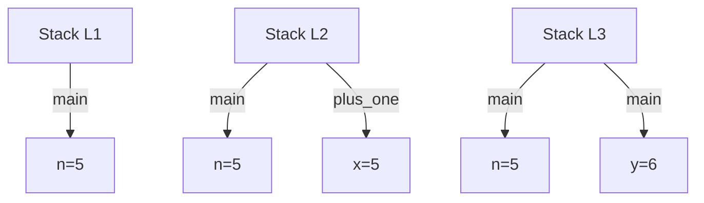

# What is Ownership?

Ownership is a fundamental concept in Rust that ensures that safety and efficiency of programs. To grasp ownership, it's crucial to understand what makes a Rust program safe and how Rust's rules prevent unsafe behavior

### Safety is the Absence of Undefined Behavior

Let's start with an example. This program is safe to execute:

```rust
fn read(y: bool) {
    if y {
        println!("y is true!");
    }
}

fn main() {
    let x = true;
    read(x);
}
```

We can make this program unsafe to execute by moving the call to `read` before the definition of `x`:
_This code does not compile!_

```rust
fn read(y: bool) {
    if y {
        println!("y is true!");
    }
}

fn main() {
    read(x); // oh no! x isn't defined!
    let x = true;
}
```

> Note: in this chapter, we will use many code examples that do not compile. Make sure to look for the question mark crab if you are not sure whether a program should compile or not.

This second program is unsafe because `read(x)` expects `x` to have a value of type `bool`, but `x` doesn't have a value yet.

When a program like this is executed by an interpreter, then reading x before it's defined would raise an exception such as Python's [NameError](https://docs.python.org/3/library/exceptions.html#NameError) or Javascript's [ReferenceError](https://developer.mozilla.org/en-US/docs/Web/JavaScript/Reference/Global_Objects/ReferenceError). But exceptions come at a cost. Each time an interpreted program reads a variable, then the interpreter must check whether that variable is defined.

Rust's goal is to compile programs into efficient binaries that require as few runtime checks as possible. Therefore Rust does not check at runtime whether a variable is defined before being used. Instead, Rust checks at compile-time. If you try to compile the unsafe program, you will get this error:

```bash
error[E0425]: cannot find value `x` in this scope
 --> src/main.rs:8:10
  |
8 |     read(x); // oh no! x isn't defined!
  |          ^ not found in this scope
```

The key idea here is that Rust eliminates undefined behavior by ensuring that the code is safe and compile-time, avoiding potential runtime errors that could compromise the program's correctness and security.

You probably have the intuition that it's good for Rust to ensure that variables are defined before they are used. But why? To justify the rule, we have to ask: **what would happen if Rust allowed a rejected program to compile?**

Let's first consider how the safe program compiles and executes. On a computer with a processor using an [x86](https://en.wikipedia.org/wiki/X86) architecture, Rust generates the following assembly code for the main function in the safe program ([see the full assembly code here](https://rust.godbolt.org/z/xnT1fzsqv)):

> Note: if you aren't familiar with assembly code, that's ok! This section contains a few examples of assembly just to show you how Rust actually works under the hood. You don't generally need to know assembly to understand Rust.

```bash
main:
    ; ...
    mov     edi, 1
    call    read
    ; ...
```

This assembly code will:

- Move the number 1, representing `true`, into a "register" (a kind of assembly variable) called `edi`.
- Call the `read` function, which expects its first argument `y` to be in the `edi` register.

If the unsafe function was allowed to compile, its assembly might look like this:

```bash
main:
    ; ...
    call    read
    mov     edi, 1    ; mov is after call
    ; ...
```

This program is unsafe because `read` will expect `edi` to be a boolean, which is either the number `0` or `1`. But `edi` could be anything: `2`, `100`, `0x1337BEEF`. When `read` wants to use its argument `y` for any purpose, it will immediately cause **UNDEFINED BEHAVIOR!**

Rust doesn't specify what happens if you try to run `if y { .. }` when `y` isn't `true` or `false`. That _behavior_, or what happens after executing the instruction, is undefined. Something will happen, for example:

- The code executes without crashing, and no one notices a problem.
- The code immediately crashes due to a [segmentation fault](https://en.wikipedia.org/wiki/Segmentation_fault) or another kind of operating system error.
- The code executes without crashing, until a malicious actor creates the right input to delete your production database, overwrite your backups, and steal your lunch money.

**A foundational goal of Rust is to ensure that your programs never have undefined behavior.** That is the meaning of "safety." Undefined behavior is especially dangerous for low-level programs with direct access to memory. About [70% of reported security vulnerabilities](https://msrc.microsoft.com/blog/2019/07/a-proactive-approach-to-more-secure-code/) in low-level systems are caused by memory corruption, which is one form of undefined behavior.

A secondary goal of Rust is to prevent undefined behavior at compile-time instead of run-time. This goal has two motivations:

- Catching bugs at compile-time means avoiding those bugs in production, improving the reliability of your software.
- Catching bugs at compile-time means fewer runtime checks for those bugs, improving the performance of your software.

Rust cannot prevent all bugs. If an application exposes a public and unauthenticated `/delete-production-database` endpoint, then a malicious actor doesn't need a suspicious if-statement to delete the database. But Rust's protections are still likely to make programs safer versus using a language with fewer protections, e.g. as found by [Google's Android team](https://security.googleblog.com/2022/12/memory-safe-languages-in-android-13.html).

### Ownership as a Discipline for Memory Safety

In Rust, ownership is the key concept that ensures memory safety by preventing undefined behavior related to memory operations. To understand ownership, it's essential to first grasp what memory is and how it is managed during the execution if a program.

#### What is Memory?

Memory refers to the space where data is stored while a program runs. Here are two common ways to think about memory:

1. **High-Level Perspective**
   - If you're not familiar with systems programming, you might consider memory in a board sense, such as "memory is the RAM in my computer" or "memory is something that gets used up when I load too much data"
2. **Low-Level Perspective**
   - If your are more experienced with systems programming, you might think of memory as "an array of byte" or "the addresses returned by `malloc`."

While both perspectives are valid, they aren't the most effective for understanding Rust's approach to memory, The high-level view is too abstract, lacking the detail needed to explain Rust's mechanisms. Conversely, the low-level view is too specific, as Rust doesn't allow you to treat memory as just array of bytes.

#### The Rust Model of Memory

Rust introduces a unique model for thinking about memory, and ownership is the discipline that governs how memory is safely used within this model. Ownership is Rust involves a set of rules and practices that prevent common memory-related errors, such as:

1.  **Dangling Pointers**

A dangling pointer occurs when a pointer refers to a memory location that has already been freed or is no longer valid. Using this pointer can lead to undefined behavior. Rust prevents dangling pointers through its ownership system.

```rust
fn main() {
    let r;
    {
        let x = 5;
        r = &x; // ERROR: `x` does not live long enough
    }
    // `x` goes out of scope here, but `r` still holds a reference to it
    println!("r: {}", r);
}
```

- In this example, `r` tries to hold a reference to `x`, but `x` goes out of scope before `r` is used. If Rust allowed this, `r` would become a dangling pointer because it would point to memory that's no longer valid. Rust' ownership rules prevent this from compiling.

2.  **Double Free**

Double free occurs when program tries to deallocate the same memory more than once, which can corrupt the memory and cause undefined behavior. Rust's ownership system ensures that memory is freed only once when the owner of the memory goes out of scope.

```rust
fn main() {
    let s1 = String::from("hello");
    let s2 = s1; //Ownership of memory is moved from `s1` to `s2`

    // `s1` is now invalid and can't be used
    // println!("{}", s1); // ERROR `s1` is invalid because its ownership was moved
    // only `s2` will be used, and its memory will be freed at the end of scope
}
```

- Here, when `s2` takes ownership of the memory, `s1` is no longer valid. Rust ensures that when `s2` goes out of scope, the memory is freed once, preventing double free errors.

3. **Memory Leaks**

A memory leak occurs when a program allocates memory but never frees it, which can lead to .wasted memory and eventually crash the program. Rust's ownership model ensures that memory is freed when it is no longer needed.

```rust
fn main() {
    {
        let s = String::from("hello");
        // `s` is valid in this scope
    }
    // `s` goes out of scope here, and it's memory it automatically freed
}
```

In this example, the string `s` is automatically deallocated when it goes out of scope. Rust's ownership model ensures that the memory is properly freed, preventing memory leaks.

##### Summary

- **Dangling Pointer:** Rust prevents them by ensuring that reference are always valid for as long as they are in use.
- **Double Free:** Rust's ownership model ensures that only one owner can free the memory, thus preventing multiple frees.
- **Memory Leaks:** Rust automatically frees memory when the owner goes out of scope, ensuring that memory is not leaked.

By following ownership rules, Rust ensures that your programs are safe from these types of undefined behavior, making them more reliable and secure. The rest of this chapter will delve deeper into how Rust's ownership model work and how it helps you manage memory safely and efficiently.

### Variables Live in the Stack

In Rust, variables are stored in memory frames called **stack frames**, which represent the state of a function at a particular point in its execution. Here's an example program that demonstrates how variables are allocated on the stack during function calls:

```rust
fn main() {
    let n 5; // `L1`
    let y = plus_one(n); // `L3`
    println!("The Value of y is: {y}");
}

fn plus_one(x: i32) -> i32 {
    x + 1 // `L2`
}
```

Now, let's break down the memory model of this program at three specific points (`L1`, `L2`, and `L3`) during its execution.

- **At L1 (inside `main`):** A new stack frame for `main` is created, and the variable `n` is initialized with value `5`
- **At L2 (inside `plus_one`):** When the function `plus_one` is called, a new stack frame for `plus_one` is created. The argument `x` is passed in with a value of `5`, copied from `n` in `main`
- **At L3 (after `plus_one` returns):** The function `plus_one` finishes, and its stack frame is deaalocated (freed). The returned value `6` is stored in `y` in the stack frame for `main`.

#### Stack Visualization

To visualize the stack at each point, we can think of the program as follows:

- **L1:** The stack contains a frame for `main` with the variable `n = 5`.
- **L2:** The stack contains a frame for `main` (`n = 5`) and a frame for `plus_one` (`x = 5`).
- **L3:** The `plus_one` frame is removed, leaving `main` with `n = 5` and `y = 6`.



#### Frames and Stacks

In Rust, Variables live in **frames**, and a frame corresponds to a scope, like a function. These frames are organized into a **stack** because each function call adds a new frame to the stack. Once a function finishes, its frame is deallocated (or dropped), and the program returns to the previous frame.

For example:

- At `L1`, `main` has a frame holding `n = 5`.
- At `L2`, `main` holds `n = 5`, and the called function `plus_one` holds `x = 5`.
- At `L3`, `plus_one` is done, and `main` now holds `n = 5` and `y = 6`.

This sequence of stacking frames follow a **Last In, First Out** (LIFO) principle, where the last function added to the stack is the first one removed.

#### Copying Variables

When you copy a variable, the value is duplicated into the new variable, and the original remains unchanged. Consider this example:

```rust
let a = 5; // `L1`
let mut b = a; // `L2`
b += 1; // `L3`
```

- **At L1:** `a` is set to 5.
- **At L2:** The value of `a` is copied into `b`, so `b = 5` and `a = 5`.
- **At L3:** `b` is incremented, so now `b = 6` while `a` remains 5.

In Rust, variable like `a` and `b` are **copied** rather than shared by reference when stored in the stack.

This ensures the integrity of variable without the risk of modifying a variable unintentionally through another reference.
