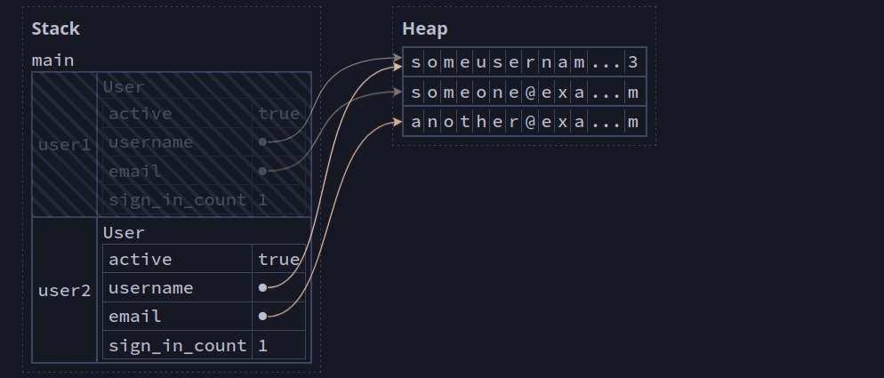

# 5.1 Defining and Instantiating Structs

Structs in Rust are similat to tuples, discussed in “[The Tuple Type](https://github.com/nimodb/rust-journey/tree/main/3-common-programming-concepts/4-data-types/2-compound#the-tuple-type)” section, as both can hold multiple related values. However, unlike tuples, structs allow you to name each piece of data, making the meaning of the values much clearer. This gives structs more flexibility compared to tuples, as you don't need to rely on the order of data to understand or access a specific value.

To define a struct, you use the `struct` keyword followed by the struct's name, which should describe the meaning of the grouped data. Inside curly brackets `{}`, you list the fields—each with a name and a type. For example the following struct defines a user account:

```rust
struct User {
    active: bool,
    username: String,
    email: String,
    sign_in_count: u64,
}
```

Once the struct is defined, you can create an instance by providing concrete values for each field. This is done using the struct's name and curly brackets containing key-value pairs where the keys are the field names, and the values are the corresponding data. You don't have to follow the same order as the struct definition when creating an instance. The struct acts like a template, and each instance is a unique value of that template. For example, the following code declares a specific user:

```rust
fn main() {
    let user1 = User {
        active: true,
        username: String::from("someusername123"),
        email: String::from("someone@example.com"),
        sign_in_count: 1,
    };
}
```

You can access specific values from a struct using dot notation. For example, to access the email of `user1`, you would use `user1.email`. If the struct instance is mutable, you can also modify values using dot notation:

```rust
fn main() {
    let mut user1 = User {
        active: true,
        username: String::from("someusername123"),
        email: String::from("someone@example.com"),
        sign_in_count: 1,
    };

    user1.email = String::from("anotheremail@example.com");
}
```

Note that in Rust, the entire instance must be mutable to modify any field; you can't make just some fields mutable. Like any expression, creating a new instance can be done as the last expression in a function body to return it implicitly.

For example, the following `build_user` function returns a new `User` instance based on the provided email and username:

```rust
fn build_user(email: String, username: String) -> User {
    User {
        active: true,
        username: username,
        email: email,
        sign_in_count: 1,
    }
}
```

It's common to name the function parameters after the struct field, but this can lead to repetition, especially for structs with many fields. Rust provides a handy shorthand for cases where the parameter names match the field names.

### Using the Field Init Shorthand

When the parameter names and struct field names are identical, you can use Rust's field init shorthand to avoid repetition. The `build_user` function can be rewritten using shorthand:

```rust
fn build_user(email: String, username: String) -> User {
    User {
        active: true,
        username,
        email,
        sign_in_count: 1,
    }
}
```

Here, we omit the repetitive `email: email` and `username: username` by writing just `email` and `username`. Rust automatically matches the field names with the parameter names.

### Creating Instances from Other Instances with Struct Update Syntax

Sometimes, you may want to create a new instance of a struct by reusing most of the values from an existing instance, but change a few fields. Rust provides a convenient way to do this using **struct update syntax**.

In the first example, we manually create a new `User` instance (`user2`) by setting a new value for the `email` field while coping the other values from `user1`:

```rust
fn main() {
    // --snip--

    let user2 = User {
        active: user1.active,
        username: user1.username,
        email: String::from("another@example.com"),
        sign_in_count: user1.sign_in_count,
    };
}
```

With struct update syntax, we can achieve the same outcome but with less code. The syntax `..` is used to specify that the remaining fields should retain the values from another instance, in this case `user1`:

```rust
fn main() {
    // --snip--

    let user2 = User {
        email: String::from("another@example.com"),
        ..user1
    };
}
```

In this example, `user2` has a different `email`, but the `username`, `active`, and `sign_in_count` fields are copied from `user1`. The `..user1` syntax must always come last to indicate that remaining fields should be filled from `user1`. You can explicitly set as many fields as you want, in any order.

It's important to note that struct update syntax involves **moving** values. For instance, since `username` is a `String` (which doesn't implement the `copy` trait), ownership of the `username` field is moved from `user1` to `user2`. As a result, `user1` can no longer be used after this operation. If `user2` had new `String` values for both `email` and `username`, then `user1` would still be valid, since only fields implementing the `copy` trait (like `active` and `sign_in_count`) are simply copied, not moved.

> Note that the struct update syntax uses = like an assignment; this is because it moves the data, just as we saw in the “[Variables and Data Interacting with Move](https://github.com/nimodb/rust-journey/tree/main/4-understanding-ownership/1-what-is-ownership#variables-and-data-interacting-with-move)” section. In this example, we can no longer use `user1` as a whole after creating `user2` because the `String` in the `username` field of `user1` was moved into `user2`. If we had given `user2` new `String` values for both `email` and `username`, and thus only used the active and `sign_in_count` values from `user1`, then `user1` would still be valid after creating `user2`. Both active and `sign_in_count` are types that implement the `Copy` trait, so the behavior we discussed in the “[Stack-Only Data: Copy](https://github.com/nimodb/rust-journey/tree/main/4-understanding-ownership/1-what-is-ownership#stack-only-data-copy)” section would apply.



### Using Tuple Structs Without Named Fields to Create Different Types

Rust also supports **tuple structs**, which are similar to tuples but provide additional meaning through a struct name, while not requiring field names. This can be useful when naming the fields in a regular struct would be excessive or redundant.

To define a tuple struct, start with the `struct` keyword and the struct name followed by the types in the tuple. For example, here we define and use two tuple structs named `Color` and `Point`:

```rust
struct Color(i32, i32, i32);
struct Point(i32, i32, i32);

fn main() {
    let black = Color(0, 0, 0);
    let origin = Point(0, 0, 0);
}
```

In this case, `black` and `origin` are instances of different types (`Color` and `Point`), even though both are made up of three `i32` values. This means you can't use a `Point` where a `Color` is expected, even though their data type look similar. You can access values in tuple structs using dot notation and their index, just like regular tuples.

### Unit-Like Structs Without Any Fields

Rust also allows you to define structs that don't have any fields. These are known as **unit-like structs** because they behave similarly to the unit type `()`, the unit type that we mentioned in “The [The Tuple Type](https://github.com/nimodb/rust-journey/tree/main/3-common-programming-concepts/4-data-types/2-compound#the-tuple-type)” section. Unit-like structs can be useful when you need to implement traits for a type but don't need to store any data in the type. We’ll discuss traits in Chapter 10

Here's an example of a unit-like struct called `AlwaysEqual`:

```rust
struct AlwaysEqual;

fn main() {
    let subject = AlwaysEqual;
}
```

Here, the `AlwaysEqual` struct is defined with no fields (just a semicolon `;` after the name). You can create an instance of this struct in the some way, without needing curly braces (`{}`) or parentheses (`()`). Later on, you could implement behavior for this struct, such as ensuring that any instance of `AlwaysEqual` is always considered equal to any other value. This is an example where you don't need data within the type itself, but rather just the type for specific behavior.

> ### Ownership of Struct Data
>
> In the `User` struct definition, we used the `String` type for `username` and `email` fields instead of the `&str` string slice type. This was a deliberate choice because we want each instance of `User` to **own** its data. That way, the data remains valid as long as the struct instance is valid.
>
> It’s also possible to store references within a structs, but this requires the use of `lifetimes`, a Rust feature that ensures the referenced data remains valid for the lifetime of the struct. We will discuss lifetimes in Chapter 10, but here's an example of what happens if you try to use references in a struct without lifetimes:
>
> ```rust
>    struct User {
>        active: bool,
>        username: &str,
>        email: &str,
>        sign_in_count: u64,
>    }
>
>    fn main() {
>        let user1 = User {
>            active: true,
>            username: "someusername123",
>            email: "someone@example.com",
>            sign_in_count: 1,
>        };
>    }
> ```
>
> The Rust compiler will return an error because it need lifetime specifiers:
>
> ```bash
> $ cargo run
>    Compiling structs v0.1.0 (file:///projects/structs)
> error[E0106]: missing lifetime specifier
>  --> src/main.rs:3:15
>   |
> 3 |     username: &str,
>   |               ^ expected named lifetime parameter
>   |
> help: consider introducing a named lifetime parameter
>   |
> 1 ~ struct User<'a> {
> 2 |     active: bool,
> 3 ~     username: &'a str,
>   |
>
> error[E0106]: missing lifetime specifier
>  --> src/main.rs:4:12
>   |
> 4 |     email: &str,
>   |            ^ expected named lifetime parameter
>   |
> help: consider introducing a named lifetime parameter
>   |
> 1 ~ struct User<'a> {
> 2 |     active: bool,
> 3 |     username: &str,
> 4 ~     email: &'a str,
>   |
>
> For more information about this error, try `rustc --explain E0106`.
> error: could not compile `structs` (bin "structs") due to 2 previous errors
> ```
>
> We'll cover how to resolve these errors by using lifetimes in Chapter 10. For now, we avoid this issue by using owned types like `String` rather that references (`&str`) in out struct fields.

### Question

#### Question 1

Determine whether the program will pass the compiler. If it passes, write the expected output of the program if it were executed.

```rust
struct Point {
  x: i32,
  y: i32,
}

fn main() {
  let mut a = Point { x: 1, y: 2 };
  a.x += 1;
  let b = Point { y: 1, ..a };
  a.x += 1;
  println!("{}", b.x);
}
```

**Answer:** This program **does compile**. The output of this program will be:

```plaintext
2
```

**Context:** The `..a` syntax copies each field of `a` into `b` (except `y`), so the second `a.x += 1` has no effect on `b`.

#### Question 2

Determine whether the program will pass the compiler. If it passes, write the expected output of the program if it were executed.

```rust
struct Point {
  x: i32,
  y: i32,
}

fn main() {
  let mut p = Point { x: 1, y: 2 };
  let x = &mut p.x;
  let y = &mut p.y;
  *x += 1;
  *y += 1;
  println!("{} {}", p.x, p.y);
}
```

**Answer:** This program **does compile**. The output of this program will be:

```plaintext
2 3
```

**Context:** Rust understands that `.x` refers to a different object than `.y`, so it is valid to take simultaneous mutable references to both fields.
